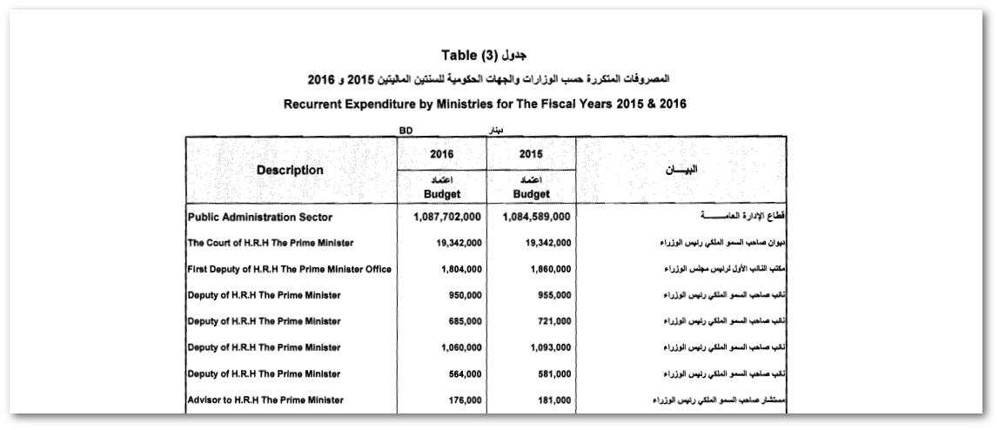

# Bahrain Budget Data Repository

The Bahrain Budget Data project makes the government of Bahrain's historical budget data freely available to the public in easy to access formats such as CSV and ODS files (don't worry if you don't know what they are).

The aim of the project is to make it easier for researchers, and the general public, to analyse and scrutinise the Bahraini government's allocation of public wealth.

The budget data presented here was taken from the website of Bahrain's [Legislation & Legal Opinion Commission](http://legalaffairs.gov.bh/). We took the data from the PDF files and converted it into CSV (comma separated values) and ODS (OpenDocument Spreadsheet).

We currently have posted 20 years (1997-2016) worth of budget data so far, however we intend to extend this further back over time.

## How to use this
Each folder in this repository holds the data for every 2-year budget issued by the Bahraini government. Within each folder you can find a number of different files:

* An `.ods` file that can be opened in Microsoft Excel, or any spreadsheet software. This file contains all of the different tables for that budget period, with calculated subtotals and linked cells. This is the easiest and quickest way for anyone to begin studying a budget.
* Multiple `.csv` files containing the raw data of each table in text format. These files can be opened in Excel, but are also useful for other purposes. Each table (eg revenue, recurrent expenditure, subsidies etc) is stored in a separate file.
* A `.pdf` file containing the source data in its original form as downloaded from the Legal Affairs website, for the purposes of verification
* A `README.md` file containing metadata about the source of the dataset

## Corrections and feedback
This project is still a work-in-progrss with much room for improvement. To report any errors in the data, make a submission or give us your feedback, send us an email to us at <bahrainwatch@bahrainwatch.org> (or create a Github pull request!).

## Background
This is a project by [Bahrain Watch](https://bahrainwatch.org) with the aim of eventually making more datasets of public interest in Bahrain and the Gulf freely available.
